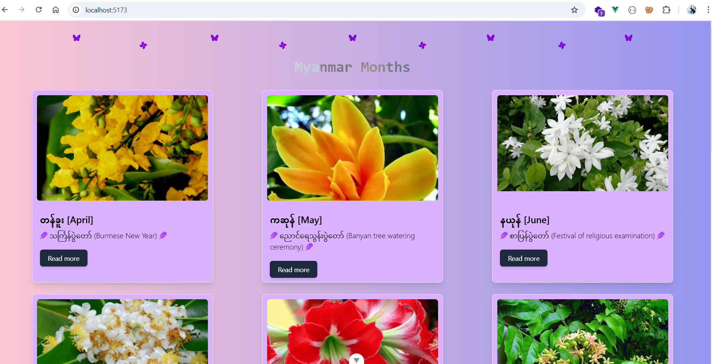
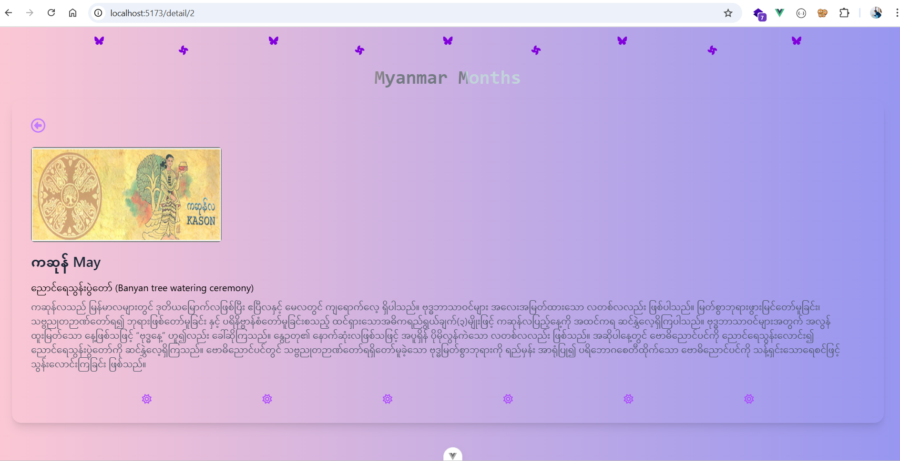

# myanmar_months
## Summary

ကိုယ်ဖတ်ချင်တဲ့ မြန်မာလကို ရွေးမယ်။ ကိုယ်ရွေးချယ်လိုက်တဲ့မြန်မာလမှာ ပွင့်တဲ့ပန်း၊ ရိုးရာပွဲ စတဲ့အကြောင်းလေးတွေ ဖတ်ကြမယ်။

project idea by *[sannlynnhtun-coding](https://github.com/sannlynnhtun-coding)*




## Recommended IDE Setup

[VSCode](https://code.visualstudio.com/) + [Volar](https://marketplace.visualstudio.com/items?itemName=Vue.volar) (and disable Vetur).

## Customize configuration

See [Vite Configuration Reference](https://vite.dev/config/).

## Project Setup

```sh
npm install
```

### Compile and Hot-Reload for Development

```sh
npm run dev
```

### Compile and Minify for Production

```sh
npm run build
```

### Run Unit Tests with [Vitest](https://vitest.dev/)

```sh
npm run test:unit
```
